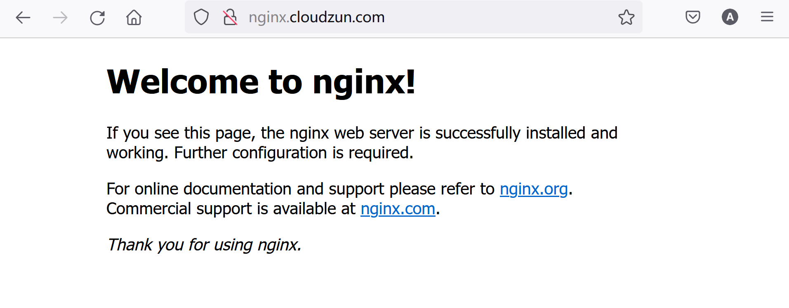
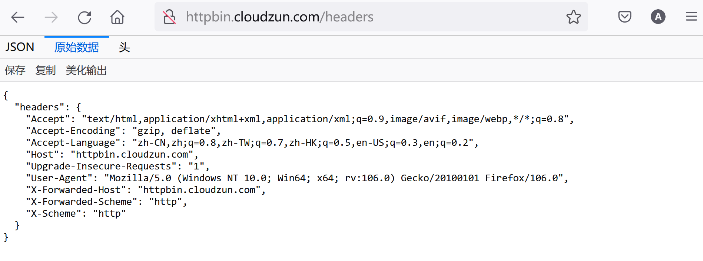

# 安装nginx-ingress-controller


下载helm项目

```bash
helm repo add ingress-nginx https://kubernetes.github.io/ingress-nginx
helm repo update
helm pull ingress-nginx/ingress-nginx 
```


编辑value.yaml

```bash
tar xf ingress-nginx-4.4.0.tgz
cd ingress-nginx/
nano value.yaml
```


修改映像位置（可选）

```yaml
controller:
  name: controller
  image:
    ## Keep false as default for now!
    chroot: false
    registry: registry.k8s.io # 替换成国内映像库，比如registry.cn-beijing.aliyuncs.com
    image: ingress-nginx/controller # 替换为映像目录，比如：cloudzun/controller
    ## for backwards compatibility consider setting the full image url via the repository value below
    ## use *either* current default registry/image or repository format or installing chart by providing the values.yaml will fail
    ## repository:
    tag: "v1.5.1"
    digest: sha256:4ba73c697770664c1e00e9f968de14e08f606ff961c76e5d7033a4a9c593c629 # 注释掉
    digestChroot: sha256:c1c091b88a6c936a83bd7b098662760a87868d12452529bad0d178fb36147345 #注释掉
    pullPolicy: IfNotPresent
    # www-data -> uid 101
    runAsUser: 101
    allowPrivilegeEscalation: true
```


hostNetwork设置为true

```yaml
 # -- Required for use with CNI based kubernetes installations (such as ones set up by kubeadm),
  # since CNI and hostport don't mix yet. Can be deprecated once https://github.com/kubernetes/kubernetes/issues/23920
  # is merged
  hostNetwork: true #修改为true
```


dnsPolicy设置为ClusterFirstWithHostNet

```yaml
  # -- Optionally change this to ClusterFirstWithHostNet in case you have 'hostNetwork: true'.
  # By default, while using host network, name resolution uses the host's DNS. If you wish nginx-controller
  # to keep resolving names inside the k8s network, use ClusterFirstWithHostNet.
  dnsPolicy: ClusterFirstWithHostNet #修改为ClusterFirstWithHostNet
```


NodeSelector添加ingress: "true"部署至指定节点

```yaml
  # -- Node labels for controller pod assignment
  ## Ref: https://kubernetes.io/docs/user-guide/node-selection/
  ##
  nodeSelector:
    kubernetes.io/os: linux
    ingress: "true" #此处增加一行
```


类型更改为kind: DaemonSet

```yaml
  # -- Use a `DaemonSet` or `Deployment`
  kind: DaemonSet # 选择DaemonSet
```


将Ingress Nginx设置为默认的ingressClass

```yaml
  ## This section refers to the creation of the IngressClass resource
  ## IngressClass resources are supported since k8s >= 1.18 and required since k8s >= 1.19
  ingressClassResource:
    # -- Name of the ingressClass
    name: nginx
    # -- Is this ingressClass enabled or not
    enabled: true
    # -- Is this the default ingressClass for the cluster
    default: true #设置为true
    # -- Controller-value of the controller that is processing this ingressClass
    controllerValue: "k8s.io/ingress-nginx"
```


给节点打标签,使其承载ingress-nginx-controller

```bash
kubectl label node node2 ingress=true
kubectl label node node3 ingress=true
```


安装ingress-nginx-controller

```bash
kubectl create ns ingress-nginx
helm install ingress-nginx -n ingress-nginx .
```


检查安装结果

```
kubectl get ingressclass -o wide
```

```bash
root@node1:~/ingress-nginx# kubectl get ingressclass -o wide
NAME    CONTROLLER             PARAMETERS   AGE
nginx   k8s.io/ingress-nginx   <none>       35m
```


```bash
kubectl get pod -n ingress-nginx -o wide
```

```bash
root@node1:~/ingress-nginx# kubectl get pod -n ingress-nginx -o wide
NAME                             READY   STATUS    RESTARTS   AGE   IP              NODE    NOMINATED NODE   READINESS GATES
ingress-nginx-controller-btszm   1/1     Running   0          64m   192.168.1.233   node3   <none>           <none>
ingress-nginx-controller-zchpt   1/1     Running   0          64m   192.168.1.232   node2   <none>           <none>
```


在某台承载ingress-nginx-controller的节点上检查通讯

```bash
netstat -lntp | grep 443
```

```bash
root@node2:~# netstat -lntp | grep 443
tcp        0      0 0.0.0.0:443             0.0.0.0:*               LISTEN      1063738/nginx: mast
tcp        0      0 0.0.0.0:443             0.0.0.0:*               LISTEN      1063738/nginx: mast
tcp        0      0 0.0.0.0:443             0.0.0.0:*               LISTEN      1063738/nginx: mast
tcp        0      0 0.0.0.0:443             0.0.0.0:*               LISTEN      1063738/nginx: mast
tcp6       0      0 :::8443                 :::*                    LISTEN      1063593/nginx-ingre
tcp6       0      0 :::443                  :::*                    LISTEN      1063738/nginx: mast
tcp6       0      0 :::443                  :::*                    LISTEN      1063738/nginx: mast
tcp6       0      0 :::443                  :::*                    LISTEN      1063738/nginx: mast
tcp6       0      0 :::443                  :::*                    LISTEN      1063738/nginx: mast
```


```bash
ps aux | grep nginx
```

```bash
root@node2:~# ps aux | grep nginx
systemd+ 1063573  0.0  0.0    204     4 ?        Ss   09:28   0:00 /usr/bin/dumb-init -- /nginx-ingress-controller --publish-service=ingress-nginx/ingress-nginx-controller --election-id=ingress-nginx-leader --controller-class=k8s.io/ingress-nginx --ingress-class=nginx --configmap=ingress-nginx/ingress-nginx-controller --validating-webhook=:8443 --validating-webhook-certificate=/usr/local/certificates/cert --validating-webhook-key=/usr/local/certificates/key
systemd+ 1063593  0.1  0.5 752476 44228 ?        Ssl  09:28   0:03 /nginx-ingress-controller --publish-service=ingress-nginx/ingress-nginx-controller --election-id=ingress-nginx-leader --controller-class=k8s.io/ingress-nginx --ingress-class=nginx --configmap=ingress-nginx/ingress-nginx-controller --validating-webhook=:8443 --validating-webhook-certificate=/usr/local/certificates/cert --validating-webhook-key=/usr/local/certificates/key
systemd+ 1063738  0.0  0.4 145176 36344 ?        S    09:28   0:00 nginx: master process /usr/bin/nginx -c /etc/nginx/nginx.conf
systemd+ 1063758  0.0  0.5 157300 41144 ?        Sl   09:28   0:00 nginx: worker process
systemd+ 1063760  0.0  0.5 157300 41004 ?        Sl   09:28   0:00 nginx: worker process
systemd+ 1063761  0.0  0.5 157300 40988 ?        Sl   09:28   0:00 nginx: worker process
systemd+ 1063762  0.0  0.5 157300 40988 ?        Sl   09:28   0:00 nginx: worker process
systemd+ 1063763  0.0  0.3 143120 29232 ?        S    09:28   0:00 nginx: cache manager process
root     1130900  0.0  0.0   8900   724 pts/0    S+   10:15   0:00 grep --color=auto nginx
```


# 使用Ingress Nginx发布单个web服务


## Nginx Web

创建实例web服务

```bash
kubectl create ns study-ingress
kubectl create deploy nginx --image=nginx -n  study-ingress
kubectl expose deploy nginx --port 80 -n study-ingress
```


查看web服务实例细节

```bash
kubectl get pod -n study-ingress -o wide
kubectl get svc -n study-ingress -o wide
```

```bash
root@node1:~/ingress-nginx# kubectl get pod -n study-ingress -o wide
NAME                     READY   STATUS    RESTARTS   AGE     IP               NODE    NOMINATED NODE   READINESS GATES
nginx-85b98978db-x49zb   1/1     Running   0          2m45s   10.244.166.183   node1   <none>           <none>
root@node1:~/ingress-nginx# kubectl get svc -n study-ingress -o wide
NAME    TYPE        CLUSTER-IP       EXTERNAL-IP   PORT(S)   AGE     SELECTOR
nginx   ClusterIP   10.102.210.108   <none>        80/TCP    2m53s   app=nginx
```


尝试对服务进行访问

```bash
curl 10.102.210.108
```

```bash
root@node1:~# curl 10.102.210.108
<!DOCTYPE html>
<html>
<head>
<title>Welcome to nginx!</title>
<style>
html { color-scheme: light dark; }
body { width: 35em; margin: 0 auto;
font-family: Tahoma, Verdana, Arial, sans-serif; }
</style>
</head>
<body>
<h1>Welcome to nginx!</h1>
<p>If you see this page, the nginx web server is successfully installed and
working. Further configuration is required.</p>

<p>For online documentation and support please refer to
<a href="http://nginx.org/">nginx.org</a>.<br/>
Commercial support is available at
<a href="http://nginx.com/">nginx.com</a>.</p>

<p><em>Thank you for using nginx.</em></p>
</body>
</html
```


创建指向上述服务的ingress

```bash
nano web-ingress.yaml
```

```yaml
apiVersion: networking.k8s.io/v1
kind: Ingress
metadata:
  name: nginx-ingress
  namespace: study-ingress
spec:
  ingressClassName: nginx
  rules:
  - host: nginx.cloudzun.com
    http:
      paths:
      - backend:
          service:
            name: nginx
            port:
              number: 80
        path: /
        pathType: ImplementationSpecific
```

```bash
kubectl create -f web-ingress.yaml
```


查看ingress

```bash
kubectl get ingress -n study-ingress
```

```bash
root@node1:~# kubectl get ingress -n study-ingress
NAME            CLASS   HOSTS                ADDRESS   PORTS   AGE
nginx-ingress   nginx   nginx.cloudzun.com             80      10m
```


检查ingress配置

```bash
kubectl get pod -n ingress-nginx
kubectl exec -it ingress-nginx-controller-btszm  -n ingress-nginx -- bash
ls 
grep  "nginx.cloudzun.com" nginx.conf
```

```bash
root@node1:~# kubectl exec -it ingress-nginx-controller-btszm  -n ingress-nginx -- bash
bash-5.1$ ls
fastcgi.conf            koi-utf                 modsecurity             owasp-modsecurity-crs   uwsgi_params.default
fastcgi.conf.default    koi-win                 modules                 scgi_params             win-utf
fastcgi_params          lua                     nginx.conf              scgi_params.default
fastcgi_params.default  mime.types              nginx.conf.default      template
geoip                   mime.types.default      opentracing.json        uwsgi_params
bash-5.1$ grep  "nginx.cloudzun.com" nginx.conf
        ## start server nginx.cloudzun.com
                server_name nginx.cloudzun.com ;
        ## end server nginx.cloudzun.com
```


亦可查看更多配置

```bash
bash-5.1$ more nginx.conf

# Configuration checksum: 2784066326814588111

# setup custom paths that do not require root access
pid /tmp/nginx/nginx.pid;

daemon off;

worker_processes 4;

worker_rlimit_nofile 1047552;

worker_shutdown_timeout 240s ;

events {
        multi_accept        on;
        worker_connections  16384;
        use                 epoll;

}

http {
        lua_package_path "/etc/nginx/lua/?.lua;;";

        lua_shared_dict balancer_ewma 10M;
        lua_shared_dict balancer_ewma_last_touched_at 10M;
        lua_shared_dict balancer_ewma_locks 1M;
        lua_shared_dict certificate_data 20M;
        lua_shared_dict certificate_servers 5M;
        lua_shared_dict configuration_data 20M;
        lua_shared_dict global_throttle_cache 10M;
        lua_shared_dict ocsp_response_cache 5M;

        init_by_lua_block {
                collectgarbage("collect")

                -- init modules
                local ok, res

--More-- (4% of 18301 bytes)
```


尝试在node1上进行访问

```bash
curl -H "Host:nginx.cloudzun.com" 192.168.1.232
```

```bash
root@node1:~# curl -H "Host:nginx.cloudzun.com" 192.168.1.232
<!DOCTYPE html>
<html>
<head>
<title>Welcome to nginx!</title>
<style>
html { color-scheme: light dark; }
body { width: 35em; margin: 0 auto;
font-family: Tahoma, Verdana, Arial, sans-serif; }
</style>
</head>
<body>
<h1>Welcome to nginx!</h1>
<p>If you see this page, the nginx web server is successfully installed and
working. Further configuration is required.</p>

<p>For online documentation and support please refer to
<a href="http://nginx.org/">nginx.org</a>.<br/>
Commercial support is available at
<a href="http://nginx.com/">nginx.com</a>.</p>

<p><em>Thank you for using nginx.</em></p>
</body>
</html>
```


修改host文件

```bash
cat >> /etc/hosts << EOF
192.168.1.232	nginx.cloudzun.com
192.168.1.233	nginx.cloudzun.com
EOF
```


尝试直接使用域名进行访问

```
curl nginx.cloudzun.com
```


```bash
root@node1~# curl nginx.cloudzun.com
<!DOCTYPE html>
<html>
<head>
<title>Welcome to nginx!</title>
<style>
html { color-scheme: light dark; }
body { width: 35em; margin: 0 auto;
font-family: Tahoma, Verdana, Arial, sans-serif; }
</style>
</head>
<body>
<h1>Welcome to nginx!</h1>
<p>If you see this page, the nginx web server is successfully installed and
working. Further configuration is required.</p>

<p>For online documentation and support please refer to
<a href="http://nginx.org/">nginx.org</a>.<br/>
Commercial support is available at
<a href="http://nginx.com/">nginx.com</a>.</p>

<p><em>Thank you for using nginx.</em></p>
</body>
</html>
```


尝试在宿主机上进行访问



## Katacoda Web


创建包含katacoda deployment svc和ingress的一体成型yaml文件

```bash
nano kata-ingress.yaml
```


```yaml
apiVersion: apps/v1
kind: Deployment
metadata:
  labels:
    app: katacoda
  name: katacoda
spec:
  replicas: 3
  selector:
    matchLabels:
      app: katacoda
  strategy: {}
  template:
    metadata:
      labels:
        app: katacoda
    spec:
      containers:
      - image: katacoda/docker-http-server
        name: docker-http-server
        resources: {}
---
apiVersion: v1
kind: Service
metadata:
  labels:
    app: katacoda
  name: katacoda
spec:
  ports:
  - name: 80-80
    port: 80
    protocol: TCP
    targetPort: 80
  selector:
    app: katacoda
  type: ClusterIP
---
apiVersion: networking.k8s.io/v1
kind: Ingress
metadata:
  name: kata-ingress
spec:
  ingressClassName: nginx
  rules:
  - host: kata.cloudzun.com
    http:
      paths:
      - backend:
          service:
            name: katacoda
            port:
              number: 80
        path: /
        pathType: ImplementationSpecific
```

```bash
kubectl apply -f kata-ingress.yaml
```


查看ingress

```bash
kubectl describe ingress kata-ingress
```

```bash
root@node1:~# kubectl describe ingress kata-ingress
Name:             kata-ingress
Labels:           <none>
Namespace:        default
Address:
Default backend:  default-http-backend:80 (<error: endpoints "default-http-backend" not found>)
Rules:
  Host               Path  Backends
  ----               ----  --------
  kata.cloudzun.com
                     /   katacoda:80 (10.244.104.62:80,10.244.135.24:80,10.244.166.185:80)
Annotations:         <none>
Events:
  Type    Reason  Age    From                      Message
  ----    ------  ----   ----                      -------
  Normal  Sync    3m19s  nginx-ingress-controller  Scheduled for sync
  Normal  Sync    3m19s  nginx-ingress-controller  Scheduled for sync
```


编辑host

```bash
cat >> /etc/hosts << EOF
192.168.1.232 kata.cloudzun.com
192.168.1.233 kata.cloudzun.com
EOF
```


本地访问

```bash
curl kata.cloudzun.com
```

```bash
root@node1:~# curl kata.cloudzun.com
<h1>This request was processed by host: katacoda-56dbd65b59-wr448</h1>
root@node1:~# curl kata.cloudzun.com
<h1>This request was processed by host: katacoda-56dbd65b59-tmgpd</h1>
root@node1:~# curl kata.cloudzun.com
<h1>This request was processed by host: katacoda-56dbd65b59-rm7cz</h1>
```


## Httpbin Service


创建一体成型的yaml文件

```bash
nano httpbin-ingress.yaml
```

```yaml
apiVersion: v1
kind: ServiceAccount
metadata:
  name: httpbin
---
apiVersion: v1
kind: Service
metadata:
  name: httpbin
  labels:
    app: httpbin
    service: httpbin
spec:
  ports:
  - name: http
    port: 8000
    targetPort: 80
  selector:
    app: httpbin
---
apiVersion: apps/v1
kind: Deployment
metadata:
  name: httpbin
spec:
  replicas: 1
  selector:
    matchLabels:
      app: httpbin
      version: v1
  template:
    metadata:
      labels:
        app: httpbin
        version: v1
    spec:
      serviceAccountName: httpbin
      containers:
      - image: docker.io/kennethreitz/httpbin
        imagePullPolicy: IfNotPresent
        name: httpbin
        ports:
        - containerPort: 80
---
apiVersion: networking.k8s.io/v1
kind: Ingress
metadata:
  name: httpbin-ingress
spec:
  ingressClassName: nginx
  rules:
  - host: httpbin.cloudzun.com
    http:
      paths:
      - backend:
          service:
            name: httpbin
            port:
              number: 8000
        path: /
        pathType: ImplementationSpecific
```

```bash
kubectl apply -f httpbin-ingress.yaml
```


更新hosts

```bash
cat >> /etc/hosts << EOF
192.168.1.232 httpbin.cloudzun.com
192.168.1.233 httpbin.cloudzun.com
EOF
```


node上访问

```bash
curl http://httpbin.cloudzun.com/status/418
```

```bash
root@node1:~# curl http://httpbin.cloudzun.com/status/418

    -=[ teapot ]=-

       _...._
     .'  _ _ `.
    | ."` ^ `". _,
    \_;`"---"`|//
      |       ;/
      \_     _/
        `"""`
```


浏览器上访问



# 域名重定向


创建yaml文件

```bash
nano redirect.yaml
```

```yaml
apiVersion: networking.k8s.io/v1
kind: Ingress
metadata:
  annotations:
    nginx.ingress.kubernetes.io/permanent-redirect: https://www.cloudzun.com
    nginx.ingress.kubernetes.io/permanent-redirect-code: '308'
  name: nginx-redirect
  namespace: study-ingress
spec:
  ingressClassName: nginx
  rules:
  - host: nginx.redirect.com
    http:
      paths:
      - backend:
          service:
            name: nginx
            port:
              number: 80
        path: /
        pathType: ImplementationSpecific
```

```bash
kubectl apply -f redirect.yaml
```


查看ingress

```bash
kubectl describe ingress nginx-redirect  -n study-ingress
```

```bash
root@node1:~# kubectl describe ingress nginx-redirect  -n study-ingress
Name:             nginx-redirect
Labels:           <none>
Namespace:        study-ingress
Address:
Default backend:  default-http-backend:80 (<error: endpoints "default-http-backend" not found>)
Rules:
  Host                Path  Backends
  ----                ----  --------
  nginx.redirect.com
                      /   nginx:80 (10.244.166.183:80)
Annotations:          nginx.ingress.kubernetes.io/permanent-redirect: https://www.cloudzun.com
                      nginx.ingress.kubernetes.io/permanent-redirect-code: 308
Events:
  Type    Reason  Age   From                      Message
  ----    ------  ----  ----                      -------
  Normal  Sync    82s   nginx-ingress-controller  Scheduled for sync
  Normal  Sync    82s   nginx-ingress-controller  Scheduled for sync
```


更新hosts

```
cat >> /etc/hosts << EOF
192.168.1.232 nginx.redirect.com
192.168.1.233 nginx.redirect.com
EOF
```


尝试从node上进行测试

```bash
curl -I nginx.redirect.com
```

```bash
root@node1:~# curl nginx.redirect.com
<html>
<head><title>308 Permanent Redirect</title></head>
<body>
<center><h1>308 Permanent Redirect</h1></center>
<hr><center>nginx</center>
</body>
</html>
root@node1:~# curl -I nginx.redirect.com
HTTP/1.1 308 Permanent Redirect
Date: Tue, 22 Nov 2022 05:47:31 GMT
Content-Type: text/html
Content-Length: 164
Connection: keep-alive
Location: https://www.cloudzun.com
```

